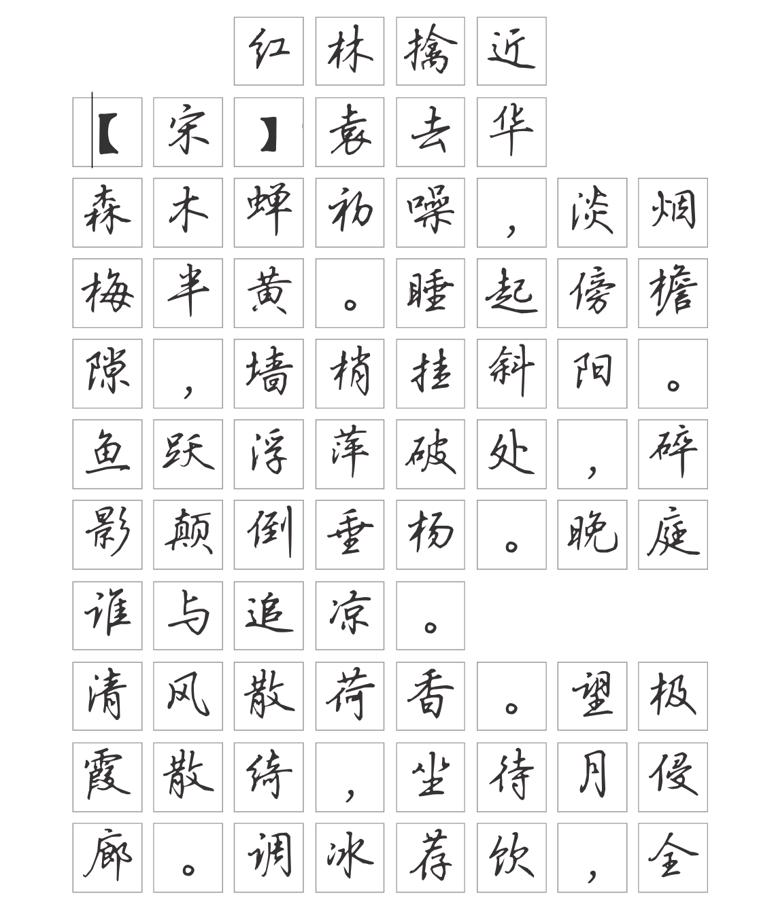
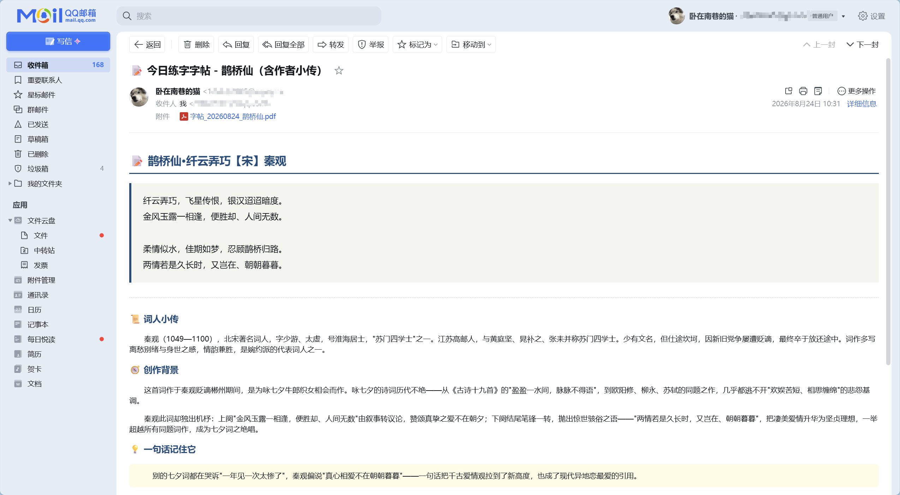

# 📜 Poetry Copybook Skill

> 每天让 AI 为你寄一封带诗词故事与字帖的「诗笺」邮件。

本项目是一个面向 AI 智能体（如 Hermes Agent）的技能插件（Skill）。每天定时自动将唐诗宋词渲染为 A4 练字帖 PDF，并由 AI 检索组装「诗人小传 + 创作背景 + 一句话精髓」的精美 HTML 邮件推送到收件箱。

---

## 📌 项目来源与致谢

本项目基于以下优秀开源项目进行二次开发与改进：

- 🖋️ **字帖渲染引擎**：[chinese-calligraphy-generator](https://github.com/njhongguan/chinese-calligraphy-generator)
- 📚 **古诗词数据库**：[chinese-poetry](https://github.com/chinese-poetry/chinese-poetry)

---

## 🖼️ 效果展示

| 📝 字帖样式（PDF 附件） | 📧 邮件样式（正文推送） |
| :---: | :---: |
|  |  |

---

## ✨ 核心特性

- 🎨 **古风排版**：采用吴玉生行楷、方格、实心字；针对宋词长句自动按阕分组分行，完美自适应 A4 页面。
- 📖 **诗文解构**：每日邮件不仅有诗文，还附带诗人小传、写作背景及白话精髓，边练字边学诗。
- 🎲 **智能选诗**：覆盖 5 万+ 首唐诗宋词，内置过滤规则，**自动排除中小学教材已学的 173 首古诗词**；支持在 `pending_poems.txt` 中指定要练的诗词。
- 🤖 **全自动化**：结合 Cron 定时任务（每天 8:00），自动渲染、AI 提炼文案、SMTP 邮件发送全流程无人值守。
- 🛡️ **字体回退**：内置多级字体 Fallback 链（瑞美加楷书 / 田英章楷书 / 系统楷体），解决生僻字缺字问题。

---

## 🛠️ 工作流

```text
每天 08:00 (Cron 触发)
  ↓
1. 执行 auto_generate_zitie.py (Playwright Headless 渲染 HTML → PDF)
  ↓
2. 输出标准 JSON: {"status":"success","pdf_path":"...","title":"...","author":"..."}
  ↓
3. AI 智能体捕获 JSON，联网/调用模型生成：小传 + 创作背景 + 一句话精髓
  ↓
4. SMTP (SSL 465) 发送 HTML 邮件及 PDF 字帖附件
```

---

## 🚀 快速使用

### 1. 环境依赖
- Python ≥ 3.9
- Node.js ≥ 20 & Playwright (`npx playwright install chromium`)
- 一个支持 SMTP 的邮箱（如 QQ 邮箱）

### 2. 部署与配置
1. 克隆字帖渲染项目至运行环境：
   ```bash
   git clone https://github.com/njhongguan/chinese-calligraphy-generator.git
   ```
2. 将本项目的技能规范与脚本配置到 Agent 对应技能目录中。
3. 配置 SMTP 发件邮箱与授权码。
4. 配置 Agent 定时任务（如每日 08:00 执行）。

> 💡 **详细配置、排版算法、邮件模板与踩坑排查详见 [SKILL.md](SKILL.md)**。

---

## 📜 开源协议

[MIT License](LICENSE)
